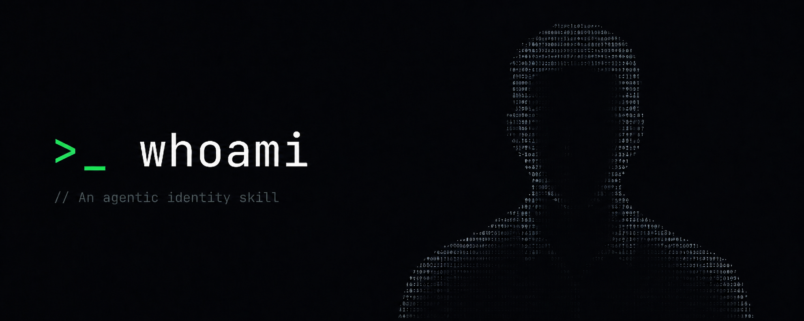

<p align="center">
  
</p>

<h1 align="center">whoami — instant user context for AI coding agents</h1>

<p align="center"><strong>Stop re-explaining yourself to every AI agent.</strong> whoami scans your machine and interviews you once, then writes a portable profile any AI coding assistant can load in seconds.</p>

<p align="center">
  <a href="./LICENSE"></a>
  <a href="https://github.com/luckeyfaraday/whoami/stargazers"></a>
  <a href="https://github.com/luckeyfaraday/whoami/commits/main"></a>
  <a href="https://github.com/luckeyfaraday/whoami/issues"></a>
  
  
  
  <a href="#contributing"></a>
</p>

## What is whoami?

**whoami is an open-source [Claude Code](https://docs.anthropic.com/en/docs/claude-code) skill that builds a complete, portable profile of who a developer is and what they do, so any AI coding agent can load instant context instead of starting cold.** It combines an automated machine scan with a short onboarding interview, then writes a single Markdown profile (`~/.whoami/profile.md`) that LLM agents — Claude Code, Cursor, Codex, and others — can read in seconds.

In one line: **whoami gives your AI agent memory of you before the conversation even starts.**

## Why developers need it

Every new AI agent session starts from zero. It doesn't know your name, your tech stack, the projects you're building, or how you prefer to work — so you re-explain your setup over and over, every session, with every tool. That repeated context-setting is wasted time and produces worse agent output.

whoami solves the **AI agent onboarding** problem permanently: capture your context once, reuse it everywhere.

## Features

- 🧠 **Machine context scanning** — reads the developer signals already on your disk
- 🎤 **Grounded onboarding interview** — captures intent and goals your files can't reveal
- 🤖 **Cross-agent session awareness** — sees your history across Claude Code, Codex, Droid/Factory, OpenCode, Gemini, and Qwen
- 📄 **Portable profile** — one dense `profile.md` any LLM agent can load as context
- 🔒 **Local & private by default** — zero network calls, secrets redacted, your data never leaves the machine
- ⚡ **One command** — run `/whoami` in Claude Code, or `bash scan.sh` standalone
- 🪪 **MIT licensed** — free, open source, auditable

## How it works

whoami works in two passes, combined into one profile:

1. **Machine scan** (`scan.sh`) — objective signals already on disk:
   - git identity & repositories (remotes, recent commits, dominant languages)
   - installed toolchains, languages, and global packages
   - editor & dotfile config (presence only)
   - **AI-agent session history across CLIs** — Claude Code, Codex, Droid/Factory, OpenCode, Gemini, Qwen (counts, recent project directories, recent prompts)
   - shell history (most-used + recent commands)
   - normal-file structure (folder layout, recently modified files)
2. **Onboarding interview** — the skill asks many *grounded* questions (made specific by what the scan found) to capture intent, priorities, working style, and goals the machine can't infer.

**Output:** `~/.whoami/profile.md` (plus `scan-raw.txt`), optionally persisted into Claude Code memory so it applies automatically in future sessions.

## Quickstart

### Install (recommended — Claude Code plugin)

Add the marketplace and install in two commands inside Claude Code:

```
/plugin marketplace add luckeyfaraday/whoami
/plugin install whoami@luckeyfaraday
```

That's it — `/whoami` is now available. Update later with `/plugin marketplace update luckeyfaraday`.

### Install (manual / for hacking on it)

Clone the repo and symlink the skill into your Claude Code skills directory:

```bash
git clone https://github.com/luckeyfaraday/whoami.git
ln -sfn "$PWD/whoami/skills/whoami" ~/.claude/skills/whoami
```

### Use

In Claude Code, run the skill:

```
/whoami
```

…or just ask: *"onboard me"* / *"figure out who I am"*. Re-running is idempotent — it diffs against your existing profile and only asks about what changed.

Run the scan standalone (no agent required):

```bash
bash scan.sh --max-repos 40 --depth 2
```

#### Flags

| flag | default | meaning |
|------|---------|---------|
| `--home DIR`     | `$HOME` | root directory to scan |
| `--max-repos N`  | `40`    | cap on git repositories reported |
| `--depth N`      | `2`     | folder-tree depth for normal files |

## What the profile looks like

```markdown
# whoami — <name>
## Snapshot          # 2–3 sentence elevator description
## Identity
## Role & focus
## Current work      # active projects, priorities, goals (dated)
## Expertise & stack
## Tooling & environment
## Working style & preferences   # how agents should behave with you
## Constraints & boundaries
## Goals
## Open questions / low-confidence
```

## Privacy

whoami reads your machine, so privacy is the core design constraint — not an afterthought:

- **Conservative scope by default** — dev/work signals + normal-file *structure* only.
- **Secrets are redacted** — lines matching key / token / password patterns are dropped.
- **Personal-doc contents are never printed** — only names and paths.
- **Everything stays local** — there are **zero network calls**. The generated profile and raw scan live under `~/.whoami/` and are gitignored.
- **Broader scope is opt-in** — browser history, SSH known_hosts, and document contents are only collected if you ask, and the skill confirms first.

`scan.sh` is a single, readable shell script — audit it before you run it.

## Supported AI agents

whoami detects and reads session history from these AI coding assistants and CLIs:

**Claude Code · OpenAI Codex · Droid (Factory) · OpenCode · Gemini CLI · Qwen Code** — plus detection for Cursor, Continue, Aider, and Ollama.

The generated profile is plain Markdown, so it works as context for **any** LLM agent, including Cursor, Windsurf, GitHub Copilot, and custom agents built on the Claude or OpenAI APIs.

## Use cases

- **Onboard a new AI agent** to your stack and projects in seconds
- **Stop repeating context** across Claude Code, Cursor, Codex, and other tools
- **Standardize agent behavior** — encode how you want agents to act (autonomous vs. ask-first, terse vs. explanatory)
- **Bootstrap agent memory** for a fresh machine or a new teammate
- **Build a personal `AGENTS.md` / context file** grounded in real signals, not guesses

## FAQ

**What is whoami?**
whoami is an open-source Claude Code skill that profiles a developer — identity, stack, projects, working style — by scanning their machine and interviewing them, producing a portable Markdown profile any AI agent can load as instant context.

**Is whoami safe / private?**
Yes. It runs entirely locally with zero network calls, redacts secrets, never prints personal-document contents, and stores output only under `~/.whoami/` (gitignored). The scanner is a single readable bash script you can audit.

**Does whoami work with agents other than Claude Code?**
Yes. While it installs as a Claude Code skill, the output is plain Markdown that works as context for any LLM agent — Cursor, Codex, Windsurf, GitHub Copilot, or custom agents on the Claude/OpenAI APIs. The scanner also runs standalone with `bash scan.sh`.

**Where does whoami store its output?**
In `~/.whoami/` — `profile.md` (the profile) and `scan-raw.txt` (the raw scan). Both are gitignored and never leave your machine.

**What data does whoami collect?**
Git identity and repos, installed toolchains and packages, dotfile presence, AI-agent session history, shell history (commands only), and normal-file structure. Secrets and personal-document contents are excluded by default.

**How is whoami different from CLAUDE.md or AGENTS.md?**
Those are hand-written, static, and per-project. whoami auto-generates a user-level profile from real machine signals plus an interview, and keeps it current across every project and agent.

## Contributing

Issues and pull requests are welcome. Good first additions: support for more agent CLIs, more package managers, and macOS/WSL coverage. Keep the privacy contract intact — no secret material, no personal-doc contents, and no network calls in `scan.sh`.

## License

[MIT](./LICENSE) © luckeyfaraday

---

<sub><b>Keywords:</b> Claude Code skill · AI agent context · LLM context · developer profile · AI coding assistant onboarding · agent memory · machine context scanner · Cursor · Codex · personal context for AI · AGENTS.md alternative · CLAUDE.md generator</sub>
